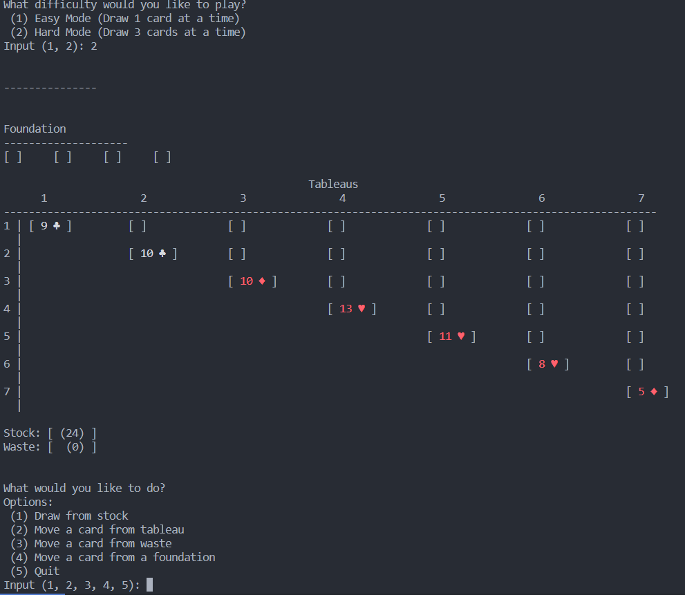
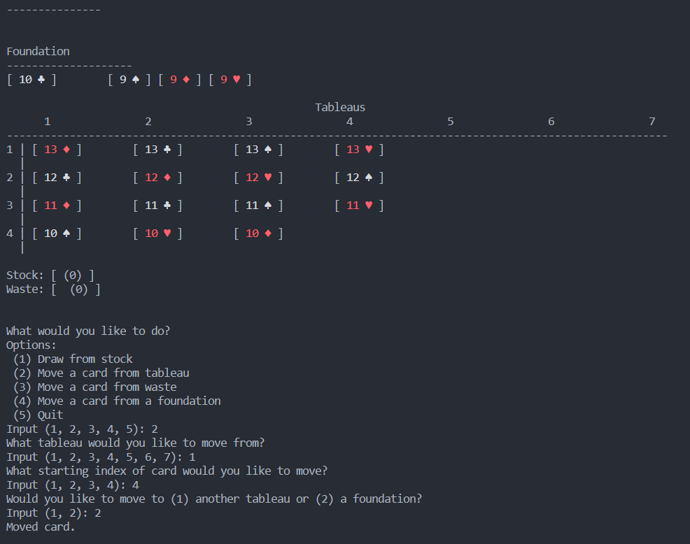

# Solitaire Game

## Overview

This is a text based Python implementation of the classic Solitaire card game. The game is played with the tableau, foundation, waste, and stock piles. The objective is to build up the foundation piles in ascending order by suit, starting from the Ace and ending with the King. This game uses a `deck` library I wrote in addition to the solitaire game.

## Features

- **Deck**: A standard deck of 52 cards is used, and the game supports two difficulty levels: Easy (draw 1 card at a time) and Hard (draw 3 cards at a time).
- **Tableau**: Consists of seven columns of cards, where the first card in each column is flipped face up.

- **Foundation**: Four piles, initially empty, where cards are built up in ascending order by suit.

- **Waste**: A pile where cards from the stock or tableau can be placed temporarily.

- **Stock**: A pile containing the remaining undealt cards.

- **Drawing**: Cards are drawn from the stock to the waste pile. In Easy mode, one card is drawn at a time, while in Hard mode, three cards are drawn at once.

- **Moving Cards**: Cards can be moved between the tableau, foundation, and waste piles according to classic solitaire rules.

## Getting Started

1. Ensure you have Python 3.10 or newer installed on your machine.
2. Clone this repository: `git clone https://github.com/devweeny/solitaire.git`
3. Navigate to the project directory: `cd solitaire`
4. Run the game: `python solitaire.py`

## Screenshots

## Gameplay

1. **Draw from Stock (Option 1)**: Clicking on this option draws cards from the stock to the waste pile.
2. **Move a Card from Tableau (Option 2)**: Select a tableau column and move cards to another tableau column or a foundation pile.
3. **Move a Card from Waste (Option 3)**: Move the top card from the waste pile to a tableau column or a foundation pile.
4. **Move a Card from Foundation (Option 4)**: Move the top card from a foundation pile to a tableau column.

## Winning the Game

- Successfully build up all four foundation piles with cards from Ace to King, sorted by suit.

Feel free to report any issues or bugs. Happy playing!
